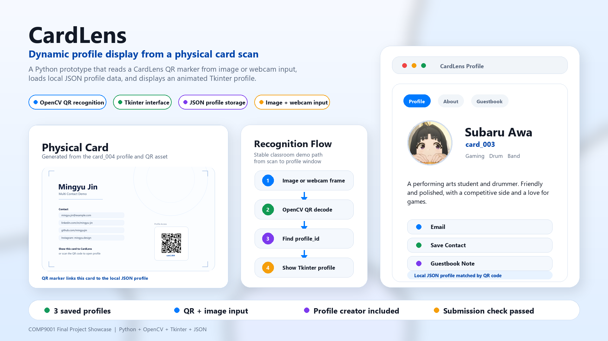

<div align="center">

# CardLens

### QR-based physical card recognition for digital profile display

CardLens is a Python desktop prototype that reads a QR code from a physical card design, loads the matching profile from local JSON data, and displays it as a clean interactive profile card.


-111827)



</div>

---

## Overview

CardLens is a Python desktop application that connects a physical card to an interactive digital profile. The idea is that a business card, resume, portfolio should not only contain printed text. By adding a CardLens QR marker, the physical card can open a richer digital profile.

```text
Card image or webcam frame
        |
        v
OpenCV QR recognition
        |
        v
profile_id
        |
        v
data/profiles.json
        |
        v
Tkinter profile display
```

## What It Does

- Scans a CardLens QR code from an image file or webcam.
- Opens the matching profile from `data/profiles.json`.
- Displays profile information in a tabbed Tkinter UI.
- Lets a user create a new CardLens profile.
- Generates a QR code for the new profile.
- Supports an optional About page visual from built-in choices or a custom icon image.
- Supports an optional showcase image and showcase description.
- Supports optional extra contact links such as GitHub, Instagram, WhatsApp, WeChat, TikTok, Xiaohongshu, and personal websites.
- Adds a Contact tab automatically when a profile has more than three contact links.
- Lets a user save contact details as a `.vcf` vCard.
- Saves guestbook notes per profile in `data/guestbook.json`.
- Lets a user delete saved local profiles.
- Reveals the main profile content with a small Tkinter `after()` animation.

## Libraries Used

This project is written in Python. The main libraries and modules used are:

- `tkinter` and `ttk` for the desktop user interface. These are included with standard Python on most installations.
- `opencv-python` for reading QR codes from image files and webcam frames.
- `Pillow` for loading, resizing, and displaying images.
- `qrcode[pil]` for generating new CardLens QR codes.
- `json` for storing profile data and guestbook notes. This is a built-in Python module.
- `pathlib` for handling file paths. This is a built-in Python module.
- `webbrowser` for opening contact links. This is a built-in Python module.
- Azure ttk theme for the visual style. The theme files are already included in `assets/azure_ttk_theme/`.

The external libraries are listed in `requirements.txt`:

```text
opencv-python>=4.8.0
Pillow>=10.0.0
qrcode[pil]>=7.4
```

## Step-by-Step Run Guide

These steps show how to run CardLens on another laptop.

### 1. Install Python

Install Python 3.9 or later from:

```text
https://www.python.org/downloads/
```

During installation on Windows, select `Add Python to PATH`.

### 2. Open the project folder

Open PowerShell or Terminal and move into the CardLens folder:

```bash
cd CardLens
```

If the folder is on the desktop, the command may look like this:

```bash
cd Desktop/CardLens
```

### 3. Install the required libraries

Run:

```bash
pip install -r requirements.txt
```

### 4. Start the program

Run the interactive menu:

```bash
python main.py
```

The menu allows the user to:

- choose an image file
- use a webcam
- create a new CardLens profile
- delete a saved local profile
- exit the program

### 5. Test with an included demo card image

From the menu, choose `Choose Image File`, then select one of these included images:

```bash
assets/demo_cards/card_001_qr_front.png
assets/demo_cards/card_003_qr_front.png
assets/demo_cards/card_004_qr_front.png
```

The program should recognize the QR code and open the matching digital profile.

### 6. Optional webcam test

From the menu, choose `Use Webcam`.

The webcam mode works with any camera recognized by the computer as a webcam, such as a laptop camera, USB webcam, or external camera connected through webcam software or a capture card.

Press `Q` or `Esc` to close the webcam window.

### 7. Optional project check

Run this command to check that the main files and demo QR images are working:

```bash
python run_check.py
```

## Quick Command Summary

Install libraries:

```bash
pip install -r requirements.txt
```

Run the interactive menu:

```bash
python main.py
```

## Run Modes

Interactive menu:

```bash
python main.py
```

Recognize a card from an image:

```bash
python main.py --image assets/demo_cards/card_001_qr_front.png
```

Other included demo card images:

```bash
python main.py --image assets/demo_cards/card_003_qr_front.png
python main.py --image assets/demo_cards/card_004_qr_front.png
```

Recognize a card from webcam:

```bash
python main.py --webcam
```

Create a new CardLens profile:

```bash
python main.py --create
```

Delete a saved local profile:

```bash
python main.py --delete
```

## Main Features

### QR Recognition

CardLens uses OpenCV's `QRCodeDetector` to read a profile ID from a QR code on the card. The payload must be a CardLens ID such as `CARDLENS:card_001` or `card_001`, so ordinary website QR codes are not treated as profile IDs.

### Profile Creation

Creator mode lets the user enter profile details, choose an optional avatar, choose an optional About page visual, choose an optional showcase image, write an optional showcase description, add optional contact accounts, and generate a new QR code. The QR code can then be added to a self-designed physical business card.

If a user enters more than three contact links, the creator keeps up to three main links on the Profile tab and places the remaining links on a Contact tab. Each contact field has a Main checkbox so the user can choose which contacts appear first.

For most social platforms, users can enter short account names instead of full URLs. For example, entering `kinn.meiu` in the Instagram field becomes an Instagram profile link internally, while the UI only shows the platform name. TikTok and Xiaohongshu use URL fields, and the program adds `https://www.` if the user leaves it out.

### Digital Profile UI

The recognized profile opens in a Tkinter window using standard `ttk` widgets and the Azure ttk theme. The profile includes:

- Profile tab
- About tab
- Optional Showcase tab
- Optional Contact tab
- Guestbook tab

The main profile tab uses a small reveal animation made with Tkinter's `after()` method. This keeps the animation simple and reliable.

### Guestbook

Each profile has its own saved notes. Notes are stored locally in `data/guestbook.json` and displayed in the Guestbook tab.

### Contact Export

The Save Contact button exports basic contact details as a `.vcf` file. This can be opened by common contact apps.

## Project Structure

```text
CardLens/
+-- main.py
+-- card_creator.py
+-- card_recognition.py
+-- profile_loader.py
+-- ui_display.py
+-- window_utils.py
+-- config.py
+-- run_check.py
+-- requirements.txt
+-- README.md
+-- data/
|   +-- profiles.json
|   +-- guestbook.json
+-- assets/
|   +-- azure_ttk_theme/
|   +-- demo_cards/
|   +-- qr_codes/
|   +-- avatars/
|   +-- about_visuals/
|   +-- highlights/
|   +-- icons/
```

## Technical Highlights

- `Tkinter` and `ttk` for the desktop interface.
- `OpenCV` for QR code recognition from images and webcam frames.
- `Pillow` for loading and resizing profile images.
- `qrcode` for generating profile QR codes.
- `JSON` for storing profile data and guestbook notes.
- Object-oriented structure for recognition and UI display classes.
- Lightweight UI animation with Tkinter `after()`.
- Basic error handling for missing files, invalid JSON, unknown profile IDs, and webcam cancellation.

## Advanced Concepts Used

This project applies several programming concepts from COMP9001:

- GUI event handling
- File input and output
- JSON data storage
- Image processing
- Third-party library integration
- Functions and classes
- Simple animation timing with Tkinter `after()`
- Validation and error handling

## Scope Adjustment

The original concept described recognizing a predefined physical card. In this submitted prototype, the recognition is implemented through an embedded QR code on the card design.

This is an intentional scope choice. QR recognition is more reliable for a short classroom demo and allows tutors to test the project using either the included demo image or their own webcam.

Future versions could replace or extend the QR marker with visual card-art recognition, such as a custom logo marker or ring-code pattern.

## Known Limitations

- QR detection requires a clear and readable QR code.
- Webcam results depend on camera quality, lighting, and distance.
- The prototype recognizes the QR marker, not the full printed card artwork.
- Profiles must exist in `data/profiles.json` before they can be opened.
- Data is stored locally and is not synced online.

## Credits

CardLens application code, profile creation, QR recognition flow, JSON storage, and profile UI logic were implemented for this project.

This project uses the open-source Azure ttk theme by rdbende under the MIT License. The theme files are stored in `assets/azure_ttk_theme/`.

## Author

Zhiheng Jin  
COMP9001 Final Project
